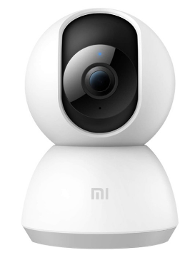
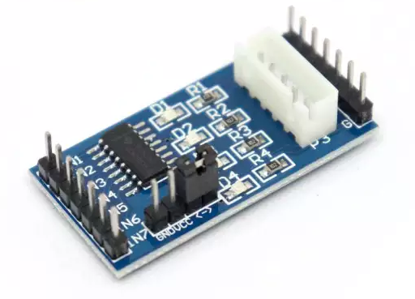
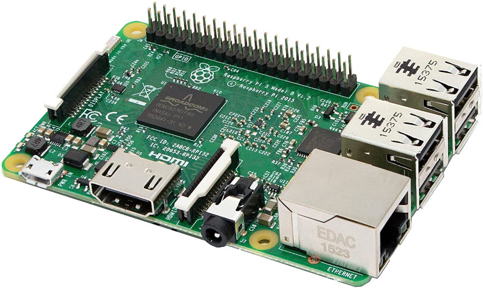
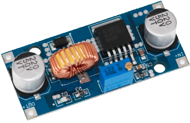

This is the schematic of the electronic needed for the turret.

# Components
- 1x xiaomi 360 camera case with horizontal and vertical DC stepper motors  

- 2x ULN2003 motro drivers  

- 2x Connectors between motors and drivers

- 1x Raspberry Pi (3 B+ or 4)  

- 1x double 18650 battery holder  

- 1x buck converter to 5V

- electric cables